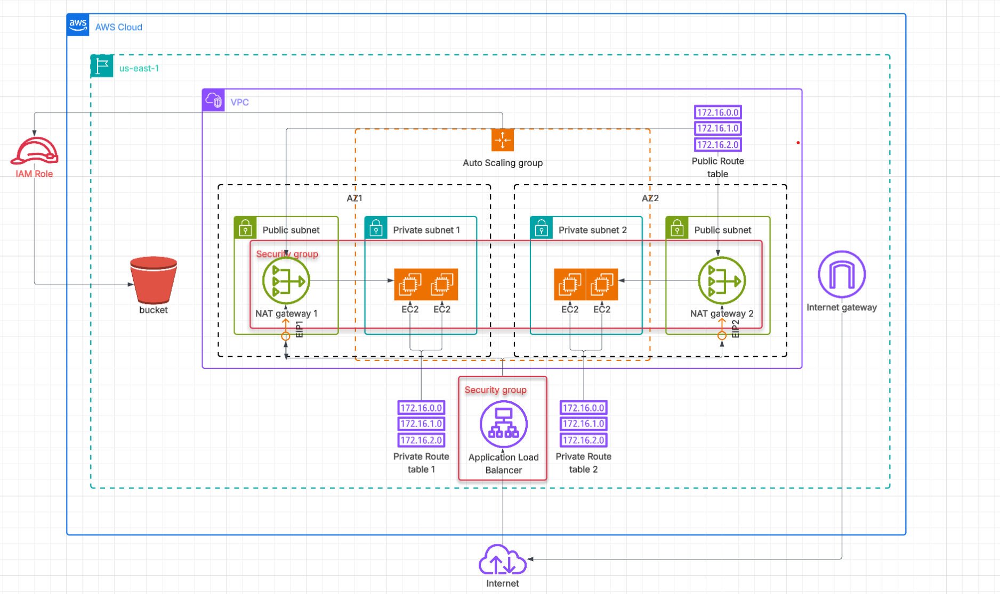

# CD12352 - Infrastructure as Code Project Solution
# Khaled Ibrahim

## Infrastructure Diagram

## Spin up instructions
- ./create.sh udagram-netowrk-stack network.yml network-parameters.json
- ./create.sh udagram-s3bucket-stack s3bucket.yml s3bucket-parameters.json
- ./create.sh udagram-stack udagram.yml udagram-parameters.json

## Tear down instructions
- ./delete.sh udagram-stack
- ./delete.sh udagram-s3bucket-stack
- ./delete.sh udagram-network-stack

## Other considerations
I just separate s3bucket stack from udagram stack for convenience and not be too much resources inside one template and I exported the InstanceProfile in the s3bucket stack output to be used in WebAppLaunchTemplate IamInstanceProfile

## LBDNS
The DNS name of the load balancer is [Udagram](http://udagra-webap-i0pfs0btdbxk-377872818.us-east-1.elb.amazonaws.com/)